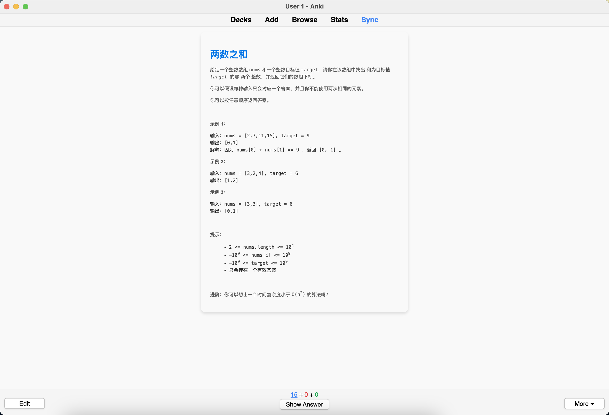
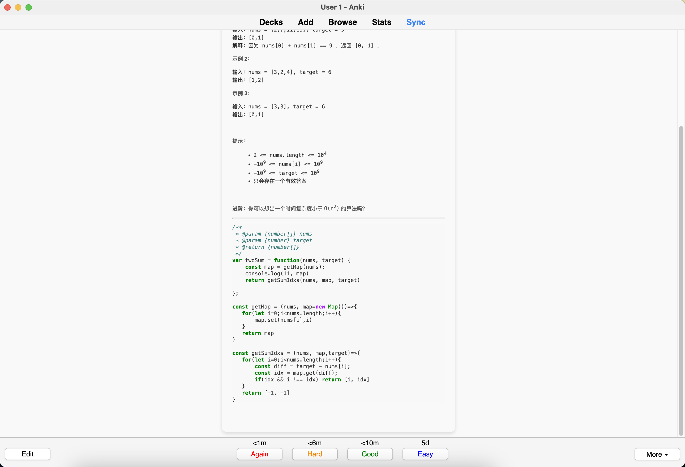
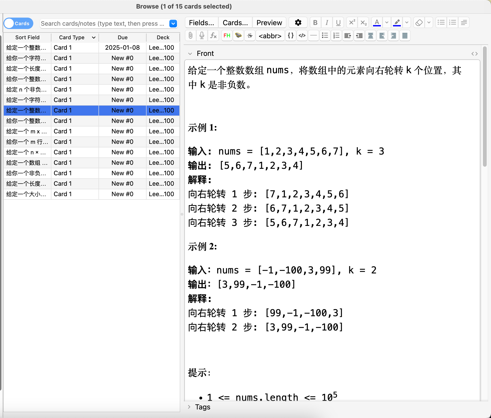

# LeetCode Anki 卡片生成器

还在为忘记 LeetCode 题解而苦恼吗？刷过的题目转眼就忘，复习效率低下，导致面试屡屡翻车？

别担心！用 Anki 的间隔记忆法，将你的 LeetCode 题解转化为高效的学习卡片，让每一道题都牢牢记在脑海中。通过记忆你的题解，快速掌握算法思维，提升刷题效率，轻松应对算法测试！

哦！对了，什么是[Anki卡片](https://apps.ankiweb.net/)？我称之为**史上最强间隔记忆软件**。本项目假设你已经了解过Anki，如果不了解，建议先找几个资料看看，然后再了解本项目的使用。

目前项目涵盖 [最受欢迎的 100 道题](https://leetcode.cn/studyplan/top-100-liked/)，让你的复习更加精准高效。

如果有需要定制其他的，可以

- fork本项目，自己定义接口
- 向本项目提交PR
- 向本项目提issue

## 成果截图

**卡片正面效果** 👇
<p align='center'>
  

</p>

**卡片反面效果** 👇

<p align='center'>
  
</p>

**卡片浏览** 👇

<p align='center'>
  
</p>

## 使用须知

- 安装anki[动态代码高亮插件](https://ankiweb.net/shared/info/1339779080)，不然代码无法高亮，影响阅读性。
- 只有你提交成功过的题目才会生成到deck中

## 如何使用本项目

1. 克隆仓库：

    ```sh
    git clone https://github.com/janice143/leetcode-anki-generator.git
    cd leetcode-anki-generator
    ```

2. 创建一个虚拟环境并激活它：

    ```sh
    python -m venv temp_env
    source venv/bin/activate  # 对于 Windows 用户，使用 `venv\Scripts\activate`
    ```

3. 根据 `requirements.txt` 文件安装所需的库：

    ```sh
    pip install -r requirements.txt
    ```

4. 创建.env文件，设置`COOKIE`字段
   cookie如何获取？[labuladong](https://github.com/labuladong)写的很好，[点击这里查看教程](https://labuladong.online/algo/intro/jetbrains/#%E7%99%BB%E5%BD%95-%E5%8A%9B%E6%89%A3-leetcode-%E8%B4%A6%E5%8F%B7)

    <p align='center'>
      
    </p>

    ```python
    COOKIE = """
    your_cookie_here
    """
    ```

5. 运行脚本生成 Anki 卡片：

    ```sh
    python main.py
    ```

6. 生成的 Anki 卡片将保存为 `leetcode_100.apkg`。

## 项目结构

- main.py：用于获取数据和创建 Anki 卡片的主脚本。
- apis.py：包含与 LeetCode API 交互的 `Leetcode` 类。
- utils.py：用于数据格式化和处理的实用函数。
- constants.py：包含项目中使用的常量。

## 欢迎贡献！🚀✨

欢迎社区贡献！无论是修复bug、提出新功能还是改进代码，你的帮助对项目非常重要。🤝

有想法或发现了问题？

👉 [提交问题](https://github.com/janice143/leetcode-anki-generator/issues) or [提交拉取请求](https://github.com/janice143/leetcode-anki-generator/pulls)!  

## 许可证

本项目采用 MIT 许可证。
